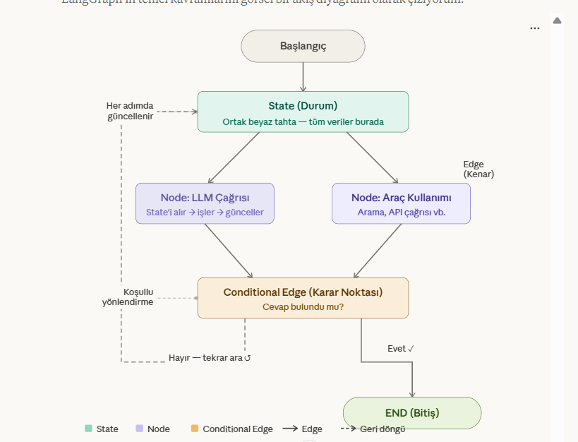

# LangGraph

LangGraph, karmaşık yapay zeka ajanları (AI Agents) ve iş akışları oluşturmak için tasarlanmış, LangChain ekosisteminin en güçlü parçalarından biridir. Geleneksel LangChain "zincirleri" (chains) doğrusal bir akış izlerken, LangGraph bize **döngüsel (cyclic)** yapılar kurma imkanı tanır.

**State (Durum) :** Fabrikanın o anki verilerini tutan ortak beyaz tahta her adımda veri güncellenir 

**Nodes (Duğum )** : İş istasyonları Her düğüm bir python fonksiyonudur. State alır bir işlem yapr mesela llme sorar araç kullanır ve stateyi günceller 

**Edges (Kenarlar ):** istasyonlar arası taşınma bantları bir düğüm sonra hangisine gidicek bellirler 

**Conditional Edges (Koşullu Kenarlar) :** Karar noktaları eğer llm cevabı buldusa bitişe git bulamadıysa arama işlemine devam et 

**Neden langGraph** 

geleneksel langchain A→B→C şeklindedir ve böyle akışlar ajan dünyasında populler 

ama gerçek dünya problemlerine geldiğimiz zmaan ajanlar şuna ihtiyaç duyar 

**Döngü :** Langchain A→B→C akışı bir kez  çallışır biter Langgrafta ajan cevabı kontrol edip yetersizse kendi kendine geri dönebillir 

**Hafıza (Persistence) :** Her node çalıştıktan sonra bir state olarak diske veya databasaye kayıt edillir konuşma yarıda kesillirse sunucu çoks e kullanıcı günler sonra dönse bile kaldığı yerden devam edebillir 

**İnsan onayı (Human-in-the-loop) :** Ajan kritik bir düğüme gelmeden önce durup insandan onay bekler. Bu noktada state kayıt edillir insan onayla reddet düzenle gibi komutlar verir ve devam edillir ve ajan kaldığı yerden devam edillir Bu mekanizmanın çalışması için persistence zorunludur çunku ajan bekleme sırasında hafızaya ihtiyaç duyar  

**İleri Seviye Özellikler :** 

**Checkpoints:** Sistemin her adımda fotorafını çeker bir hata olursa veya kullanıcı 1 saat sonra dönerse sistem kaldığı yerden devam eder ****

**Time Travel (Zaman Yolculuğu):**Hata ayıklarken ajanınızın 5 adım önceki haline dönüp oradaki veriyi değiştirip akışı tekrar başlatmanıza olanak tanır 

**Multi-Agent Systems:** Bir yönetici ajan işleri yazılımcı ve araştırmacı ajanlara dağıttır Langgraph bu karmaşık orkestrasyonu yönetmek için tasarlanmıştır 

