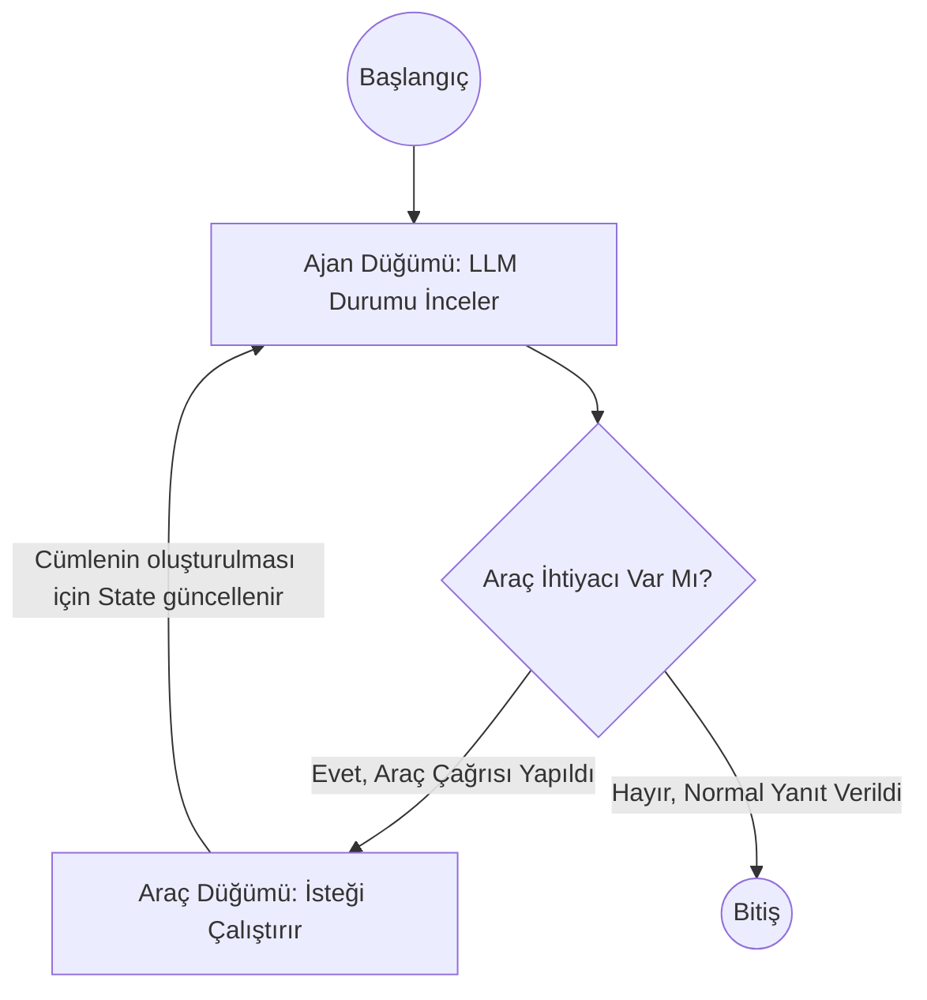

# LangGraph Temelleri ve İleri Seviye Örnekler 🦜🕸️

LangGraph, standart LangChain yeteneklerini güçlendirerek uygulamanızın **durumlu (stateful)**, döngüsel (cyclic) ve çok aktörlü (multi-actor) yeteneklerle yapılandırılmasını sağlayan devasa bir framework'tür. Bu depoda basit bir ajan tasarımından, dışarıdan araç (tool) kullanabilen karmaşık bir yapıya kadar giden bir eğitim seti hazırlanmıştır.

## 🎯 Proje Hedefi

Bu klasördeki örnekler kullanılarak şunların kavranılması amaçlanmıştır:
1. **Düğüm ve Kenar (Node & Edge) Yapıları:** Geleneksel zincir (chain) yapılarının aksine graf tabanlı akış kontrolü (`StateGraph`).
2. **Hafıza Yönetimi (Memory Checkpointing):** Geçmiş sohbet oturumlarının (`thread_id`) hatırlanarak konuşma bağlamının (context) hafızaya alınabilmesi.
3. **Araç Kullanımı (Tool Calling):** Büyük Dil Modellerinin (LLM) dış dünyaya ait (ör: hava durumu) gerçek zamanlı verilere erişmek için tanımlanmış fonksiyonları akıllıca tetiklemesi.
4. **Koşullu Yönlendirme (Conditional Routing):** Ajanın state'e ve dış verilere bakarak duruma göre hangi rotaya gideceğine karar vermesi.

## 📁 Detaylı Klasör Yapısı

```text
LangGraph/
├── images/             # Projeye dair şemalar, logolar ve ekran alıntıları burada yer alır
│   ├── image 1.png
│   ├── image 2.png
│   └── ...
├── src/                # LangGraph Python betikleri (Temel Eğitim Seti)
│   ├── memory.py       # LLM Hafıza entegrasyonu (MemorySaver)
│   ├── orn.py          # StateGraph temelleri ve Koşullu Yönlendirme
│   ├── tools.py        # ToolNode ve akıllı ajan tasarımı
│   └── README.md       # -> Python dosyalarının detaylı kod açıklamalarını içerir
└── README.md           # Proje ana yönergesi (Şu an okuduğunuz belge)
```

## 🛠️ Kurulum Yönergeleri

Uygulamanın bilgisayarınızda yerel testlerini yapabilmek için aşağıdaki yönergeleri harfiyen izlemeniz önerilir.

### 1) Python Sürümü Kontrolü
Sisteminizde Python 3.9 veya daha yüksek bir sürümün kurulu olduğundan emin olun. Komut istemcinize (cmd/powershell) şunu yazarak test edebilirsiniz:
```bash
python --version
```

### 2) Gerekli Kütüphanelerin Kurulumu
Bu projede Langchain'in temel paketleri, yapay zeka entegrasyonu (OpenAI) ve graf kütüphanesi (LangGraph) kullanılmıştır.
```bash
pip install -U langgraph langchain-openai langchain-core
```

### 3) API Key Tanımlanması
Projedeki yapay zeka ajanı `gpt-4o` modeli kullanılarak kodlanmıştır. Bu sistemin çalışabilmesi için işletim sisteminizde bir `OPENAI_API_KEY` değişkeni tanımlı olmalıdır.

**Windows (PowerShell) için örnek kullanım:**
```powershell
$env:OPENAI_API_KEY="sk-BURAYA_API_ANAHTARINIZI_GIRIN"
python src/orn.py
```
*(Alternatif olarak bu anahtarı Windows Başlat > Ortam Değişkenleri menüsünden kalıcı olarak sisteme ekleyebilirsiniz).*

## 🧠 LangGraph "Otonom Araç" Döngüsü Nasıl Çalışır?

Aşağıdaki diyagramda bu repodaki ajanın genel çalışma (Node ve Edge) mantığını (`tools.py` için) görselleştirdik:



Kodlara dair özel detayları, fonksiyonların ne işe yaradığını ve kullanım durumlarını satır satır anlamak için **[src/README.md](src/README.md) dosyasını mutlaka okuyunuz!**
