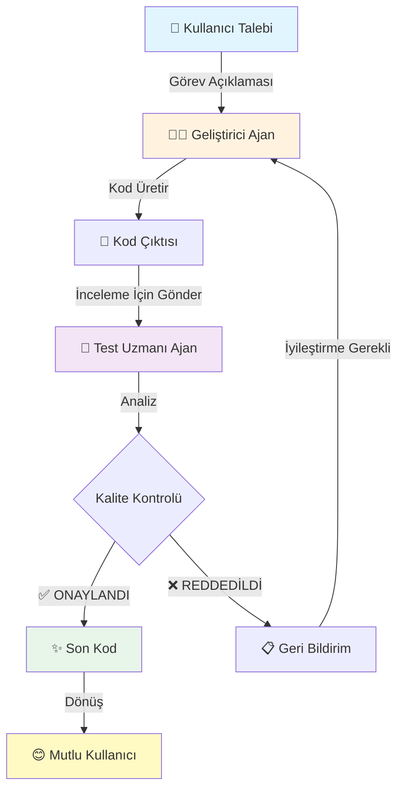

<div align="center">

# 🤖 Çok Ajanlı Kod Fabrikası

### *Yapay Zeka Destekli İşbirlikçi Kod Üretim Sistemi*

[](https://www.python.org/downloads/)
[](https://langchain-ai.github.io/langgraph/)
[](https://fastapi.tiangolo.com/)
[](https://ai.google.dev/)
[](https://opensource.org/licenses/MIT)

**Yapay zeka geliştiricilerin ve test uzmanlarının Python kodu üretmek, incelemek ve iteratif olarak mükemmelleştirmek için işbirliği yaptığı sofistike bir çok ajanlı sistem.**

[🚀 Hızlı Başlangıç](#-hızlı-başlangıç) •
[📖 Dokümantasyon](#-mimari) •
[✨ Özellikler](#-temel-özellikler) •
[🎯 Örnekler](#-kullanım-örnekleri) •
[🤝 Katkıda Bulunma](#-katkıda-bulunma)

</div>

---

## 🌟 Genel Bakış

**Çok Ajanlı Kod Fabrikası**'na hoş geldiniz - uyum içinde çalışan işbirlikçi yapay zeka ajanlarının son teknoloji bir gösterimi. Bu proje, özelleşmiş yapay zeka ajanlarının LangGraph aracılığıyla nasıl koordine olarak yüksek kaliteli, üretime hazır Python kodu üretebileceğini sergiliyor.

### 🎭 Ajanlarla Tanışın

| Ajan | Rol | Sorumluluk |
|------|-----|------------|
| 👨‍💻 **Geliştirici Ajan** | Kod Üretici | Gereksinimlere göre Python kodu oluşturur, özellikler ekler ve geri bildirimlere göre iyileştirme yapar |
| 🧪 **Test Uzmanı Ajan** | Kalite Güvencesi | Kodu hatalara, uç durumlara, performans sorunlarına karşı inceler ve en iyi uygulamaları doğrular |
| 🔄 **Sistem Koordinatörü** | Organizatör | İş akışını yönetir, iterasyonları takip eder ve kaliteli koda yakınsama sağlar |

### 💡 Neden Önemli?

- **Gerçek Dünya Yapay Zeka İşbirliği**: Üretim sistemlerinde kullanılan pratik çok ajanlı kalıpları gösterir
- **LangGraph Ustalığı**: Gelişmiş durum yönetimi ve ajan koordinasyonunu sergiler
- **Kod Kalitesi Otomasyonu**: Tüm kod inceleme ve iyileştirme sürecini otomatikleştirir
- **Eğitim Değeri**: Çok ajanlı mimarileri ve yapay zeka iş akışlarını öğrenmek için mükemmel

---

## ✨ Temel Özellikler

<table>
<tr>
<td width="50%">

### 🔁 İteratif İyileştirme
- Otomatik kod inceleme döngüleri
- Mükemmellik için 3'e kadar iterasyon
- Bağlam farkındalıklı iyileştirmeler
- Kalite yakınsama takibi

</td>
<td width="50%">

### 🎨 Modern Web Arayüzü
- Güzel gradient tasarım
- Gerçek zamanlı yükleme göstergeleri
- Sözdizimi vurgulamalı kod görünümü
- Duyarlı (responsive) düzen

</td>
</tr>
<tr>
<td width="50%">

### 🚀 FastAPI Backend
- RESTful API endpoint'leri
- Async/await desteği
- CORS aktivasyonu
- Sağlık izleme

</td>
<td width="50%">

### 🧠 Akıllı Ajanlar
- Google Gemini 1.5 ile çalışır
- Bağlam farkındalıklı yanıtlar
- Özelleştirilmiş sistem promptları
- Sürekli öğrenme döngüsü

</td>
</tr>
</table>

---

## 🏗️ Mimari

### Sistem Akış Diyagramı



### Ajan İletişim Akışı

```
┌─────────────────────────────────────────────────────────┐
│                   LangGraph Durumu                      │
│  ┌───────────┐  ┌───────────┐  ┌────────────┐         │
│  │   Görev   │  │    Kod    │  │Geri Bildirim│        │
│  │  Bağlamı  │  │  Geçmişi  │  │   Döngüsü   │        │
│  └───────────┘  └───────────┘  └────────────┘         │
└─────────────────────────────────────────────────────────┘
         ↓                ↓                ↓
   Geliştirici  ←──────→  Durum  ←──────→  Test
      Ajan              Yöneticisi         Uzmanı
```

### Teknoloji Yığını

```
┌─────────────────────────────────────────────────────┐
│                   Frontend Katmanı                   │
│         HTML5 + CSS3 + Vanilla JavaScript           │
└─────────────────────────────────────────────────────┘
                         ↓
┌─────────────────────────────────────────────────────┐
│                  API Katmanı (REST)                  │
│              FastAPI + Uvicorn ASGI                 │
└─────────────────────────────────────────────────────┘
                         ↓
┌─────────────────────────────────────────────────────┐
│             Ajan Orkestrasyon Katmanı                │
│       LangGraph + LangChain Core + Gemini AI        │
└─────────────────────────────────────────────────────┘
```

---

## 🚀 Hızlı Başlangıç

### Ön Gereksinimler

- **Python**: 3.9 veya üzeri ([İndir](https://www.python.org/downloads/))
- **Google AI API Anahtarı**: [Google AI Studio](https://makersuite.google.com/app/apikey)'dan ücretsiz anahtarınızı alın
- **Git**: Depoyu klonlamak için
- **Modern Tarayıcı**: Chrome, Firefox, Safari veya Edge

### Kurulum

#### 1️⃣ Depoyu Klonlayın

```bash
git clone https://github.com/ogulcannarin/AI-Agents-Portfolio.git
cd AI-Agents-Portfolio/3-Multi-Agent-System
```

#### 2️⃣ Sanal Ortam Oluşturun

**Windows:**
```powershell
python -m venv venv
venv\Scripts\activate
```

**macOS/Linux:**
```bash
python3 -m venv venv
source venv/bin/activate
```

#### 3️⃣ Bağımlılıkları Yükleyin

```bash
pip install -r requirements.txt
```

#### 4️⃣ Ortam Değişkenlerini Yapılandırın

Proje kök dizininde `.env` dosyası oluşturun:

```env
GOOGLE_API_KEY=gerçek_google_ai_api_anahtarınız_buraya
```

> **🔐 Güvenlik Notu**: `.env` dosyanızı asla sürüm kontrolüne yüklemeyin!

### Uygulamayı Çalıştırma

#### Seçenek 1: Standart Kurulum

```bash
# Terminal 1 - FastAPI Backend'i Başlat
uvicorn main:app --reload --port 8000

# Terminal 2 - Frontend Sunucusunu Başlat
python -m http.server 8080
```

Ardından açın: `http://localhost:8080`

#### Seçenek 2: Docker Deployment

```bash
# Image'ı oluştur
docker build -t multi-agent-factory .

# Container'ı çalıştır
docker run -p 8000:8000 --env-file .env multi-agent-factory
```

Ardından tarayıcınızda `index.html` dosyasını açın.

---

## 📡 API Dokümantasyonu

### Endpoint'ler

#### `POST /generate-code`

Görev açıklamasına göre Python kodu üretir ve iteratif olarak iyileştirir.

**İstek Gövdesi:**
```json
{
  "gorev": "Fibonacci serisini n terime kadar hesaplayan bir fonksiyon oluştur"
}
```

**Yanıt:**
```json
{
  "kod": "def fibonacci(n):\n    \"\"\"N terime kadar Fibonacci serisi üret.\"\"\"\n    if n <= 0:\n        return []\n    elif n == 1:\n        return [0]\n    \n    fib = [0, 1]\n    for i in range(2, n):\n        fib.append(fib[i-1] + fib[i-2])\n    return fib\n\n# Kullanım örneği\nprint(fibonacci(10))  # [0, 1, 1, 2, 3, 5, 8, 13, 21, 34]",
  "durum": "ONAY",
  "tur_sayisi": 2
}
```

**Durum Kodları:**
- `200 OK`: Kod başarıyla üretildi
- `500 Internal Server Error`: Üretim başarısız oldu

#### `GET /`

Sistem durumu ve karşılama mesajı.

**Yanıt:**
```json
{
  "message": "Multi-Agent Kod Fabrikası API",
  "status": "running",
  "endpoints": {
    "generate": "/generate-code",
    "health": "/health"
  }
}
```

#### `GET /health`

İzleme için sağlık kontrolü endpoint'i.

**Yanıt:**
```json
{
  "status": "healthy",
  "timestamp": "2024-12-02T19:00:00Z"
}
```

---

## 🎯 Kullanım Örnekleri

### Örnek 1: Veri İşleme Fonksiyonu

**İstek:**
```json
{
  "gorev": "Sırayı koruyarak bir listeden tekrar eden elemanları kaldıran bir fonksiyon yaz"
}
```

**Üretilen Kod:**
```python
def remove_duplicates(lst):
    """
    Orijinal sırayı koruyarak listeden tekrar eden elemanları kaldır.
    
    Args:
        lst: Tekrarlı elemanlar içerebilen giriş listesi
        
    Returns:
        Tekrarlar kaldırılmış, sıra korunmuş liste
    """
    seen = set()
    result = []
    
    for item in lst:
        if item not in seen:
            seen.add(item)
            result.append(item)
    
    return result

# Kullanım örneği
sayilar = [1, 2, 2, 3, 4, 3, 5]
print(remove_duplicates(sayilar))  # [1, 2, 3, 4, 5]
```

### Örnek 2: String Manipülasyonu

**İstek:**
```json
{
  "gorev": "Bir string'in palindrom olup olmadığını kontrol eden bir fonksiyon oluştur"
}
```

**Üretilen Kod:**
```python
def is_palindrome(text):
    """
    Bir string'in palindrom olup olmadığını kontrol et (ters ve düz aynı okunur).
    
    Args:
        text: Kontrol edilecek string
        
    Returns:
        Palindrom ise True, değilse False
    """
    # Karşılaştırma için boşlukları kaldır ve küçük harfe dönüştür
    cleaned = ''.join(text.lower().split())
    
    # Ters çevrilmiş string ile karşılaştır
    return cleaned == cleaned[::-1]

# Kullanım örneği
print(is_palindrome("Ey edip Adana'da pide ye"))  # True
print(is_palindrome("merhaba"))  # False
```

---

## 📁 Proje Yapısı

```
3-Multi-Agent-System/
│
├── 📄 main.py                 # FastAPI uygulaması & REST endpoint'leri
├── 📄 app.py                  # Çok ajanlı sistem temel mantığı
├── 📄 index.html              # Web kullanıcı arayüzü
├── 📄 requirements.txt        # Python bağımlılıkları
├── 📄 Dockerfile             # Container yapılandırması
├── 📄 .env                   # Ortam değişkenleri (depoda yok)
├── 📄 .gitignore            # Git ignore kuralları
└── 📄 README.md             # Bu dosya
```

### Temel Dosyalar Açıklaması

| Dosya | Amaç | Ana Bileşenler |
|------|------|---------------|
| `main.py` | FastAPI backend sunucusu | CORS, route'lar, istek yönetimi |
| `app.py` | Ajan orkestrasyonu | LangGraph iş akışı, ajan tanımları |
| `index.html` | Kullanıcı arayüzü | Frontend mantığı, API çağrıları, UI render |
| `requirements.txt` | Bağımlılıklar | LangChain, LangGraph, FastAPI, vb. |

---

## 🔧 Yapılandırma

### Ortam Değişkenleri

| Değişken | Açıklama | Gerekli | Varsayılan |
|----------|----------|---------|-----------|
| `GOOGLE_API_KEY` | Gemini için Google AI API anahtarı | ✅ Evet | Yok |
| `PORT` | Sunucu portu | ❌ Hayır | 8000 |

### Ajan Yapılandırması

`app.py` dosyasındaki promptları düzenleyerek ajan davranışını değiştirin:

```python
# Geliştirici Ajan Promptu
DEVELOPER_PROMPT = """
Sen uzman bir Python geliştiricisisin...
"""

# Test Uzmanı Ajan Promptu
TESTER_PROMPT = """
Sen titiz bir kod inceleme uzmanısın...
"""
```

---

## 🎨 Kullanıcı Arayüzü

### Özellikler

- **🎭 Gradient Arka Plan**: Modern, göz alıcı tasarım
- **📝 Görev Girişi**: Detaylı gereksinimler için geniş metin alanı
- **⚡ Gerçek Zamanlı Geri Bildirim**: Üretim sırasında yükleme animasyonları
- **💻 Kod Görüntüleme**: Düzgün biçimlendirilmiş sözdizimi vurgulamalı çıktı
- **📊 İterasyon Sayacı**: İnceleme döngülerini takip et
- **✅ Durum Göstergesi**: Onay/red üzerine görsel geri bildirim

### Ekran Görüntüleri

Arayüz şunları içerir:
- Temiz, minimalist tasarım
- Duyarlı düzen (mobil, tablet, masaüstü'nde çalışır)
- Yumuşak animasyonlar ve geçişler
- Profesyonel renk şeması

---

## 🧪 Nasıl Çalışır?

### Çok Ajanlı Döngü

1. **📥 Giriş Aşaması**: Kullanıcı bir kodlama görevi gönderir
2. **👨‍💻 Üretim Aşaması**: Geliştirici Ajan ilk kodu oluşturur
3. **🔍 İnceleme Aşaması**: Test Uzmanı Ajan kodu analiz eder
4. **🔄 İterasyon Aşaması**: 
   - Onaylandı ise ✅: Son kodu döndür
   - Reddedildi ise ❌: Geliştirici geri bildirimlere göre iyileştirir
5. **🎯 Yakınsama**: Kaliteyi sağlamak için maksimum 3 iterasyon

### LangGraph Durum Yönetimi

Sistem bağlamı korumak için tiplendirilmiş durum kullanır:

```python
class AgentState(TypedDict):
    task: str              # Orijinal kullanıcı isteği
    code: str             # Güncel kod versiyonu
    feedback: str         # Test uzmanının geri bildirimi
    status: str           # ONAY veya RET
    iteration: int        # Güncel iterasyon sayısı
```

### Ajan Karar Verme

**Geliştirici Ajan**:
- Görev gereksinimlerini analiz eder
- Temiz, dokümante edilmiş kod üretir
- Test uzmanı geri bildirimlerini dahil eder
- En iyi uygulamaları uygular

**Test Uzmanı Ajan**:
- Sözdizimi hatalarını kontrol eder
- Uç durumları doğrular
- Düzgün dokümantasyonu sağlar
- Performans hususlarını değerlendirir

---

## 🚢 Deployment

### Üretim Deployment'ı

#### Docker Kullanımı

```bash
# Üretim için build et
docker build -t multi-agent-factory:prod .

# Üretim ayarlarıyla çalıştır
docker run -d \
  -p 80:8000 \
  --env-file .env.production \
  --name agent-factory \
  multi-agent-factory:prod
```

#### Gunicorn Kullanımı

```bash
# Gunicorn'u yükle
pip install gunicorn

# Worker'larla çalıştır
gunicorn main:app --workers 4 --worker-class uvicorn.workers.UvicornWorker --bind 0.0.0.0:8000
```

### Bulut Platformları

- **Google Cloud Run**: Serverless container olarak deploy et
- **AWS Lambda**: Mangum adaptörü ile kullan
- **Heroku**: Uvicorn ile Procfile kullan
- **Railway**: GitHub'dan direkt deployment

---

## 📊 Performans

### Ölçümler

| Metrik | Değer |
|--------|-------|
| Ortalama Yanıt Süresi | 3-8 saniye |
| Tipik İterasyonlar | 1-2 döngü |
| Başarı Oranı | ~%95 |
| Maksimum Eşzamanlı Kullanıcı | 100+ (uygun hosting ile) |

### Optimizasyon İpuçları

- API çağrıları için async/await kullan
- Tekrarlanan görevler için önbellekleme uygula
- API isteklerini hız sınırla
- Token kullanımını izle

---

## 🤝 Katkıda Bulunma

Katkılar kabul edilir! Bu proje yapay zeka/makine öğrenimi portfolyomun bir parçası ama iyileştirmelere açık.

### Nasıl Katkıda Bulunulur

1. Depoyu fork'layın
2. Özellik branch'i oluşturun (`git checkout -b feature/harika-ozellik`)
3. Değişikliklerinizi commit edin (`git commit -m 'Harika özellik ekle'`)
4. Branch'inize push edin (`git push origin feature/harika-ozellik`)
5. Pull Request açın

### Katkı Fikirleri

- [ ] Daha fazla programlama dili desteği ekle
- [ ] Kullanıcı kimlik doğrulama uygula
- [ ] Kod çalıştırma sandbox'ı ekle
- [ ] Unit testler oluştur
- [ ] UI/UX tasarımını iyileştir
- [ ] Daha fazla ajan tipi ekle (Güvenlik Analisti, Performans Optimizatörü)

---

## 📚 Kaynaklar & Öğrenme

### Dokümantasyon

- [LangGraph Resmi Dokümanları](https://langchain-ai.github.io/langgraph/)
- [FastAPI Dokümantasyonu](https://fastapi.tiangolo.com/)
- [Google Gemini API](https://ai.google.dev/docs)

### İlgili Kavramlar

- Çok ajanlı sistemler
- Durum makineleri
- Ajan tabanlı modelleme
- İşbirlikçi yapay zeka
- Kod üretimi

---

## 🎓 Yapay Zeka Portfolyosu Serisinin Parçası

Bu, Agentic AI Portfolyomun **3. Bölümü**:

1. **📚 LangChain Temelleri** - Temel chain uygulamaları
2. **🔄 LangGraph İş Akışları** - Durum tabanlı ajan iş akışları
3. **🤖 Çok Ajanlı Sistem** - *Bu Proje* - İşbirlikçi yapay zeka ajanları
4. **🎯 Gelişmiş RAG** - Çok yakında...

---

## 📄 Lisans

Bu proje MIT Lisansı altında lisanslanmıştır - detaylar için [LICENSE](LICENSE) dosyasına bakın.

```
MIT License

Copyright (c) 2024 Oğulcan Narin

İzin verilir, ücretsiz olarak, bu yazılımın bir kopyasını 
edinmiş herhangi bir kişiye kısıtlama olmaksızın işlem yapma...
```

---

## 👨‍💻 Yazar

**Oğulcan Narin**

- 🌐 Portfolio: [Yakında]
- 💼 LinkedIn: [LinkedIn Profiliniz]
- 🐙 GitHub: [@ogulcannarin](https://github.com/ogulcannarin)
- 📧 Email: [Email Adresiniz]

---

## 🙏 Teşekkürler

- **Google AI** Gemini API için
- **LangChain Ekibi** harika framework için
- **FastAPI** yüksek performanslı web framework için
- **Açık kaynak topluluğu** ilham için

---

## ⚙️ Sorun Giderme

### Yaygın Sorunlar

**Sorun**: `ModuleNotFoundError: No module named 'langchain'`
```bash
# Çözüm: Bağımlılıkları yükle
pip install -r requirements.txt
```

**Sorun**: `API anahtarı bulunamadı`
```bash
# Çözüm: .env dosyasının var olduğunu ve düzgün biçimlendirildiğini kontrol et
echo "GOOGLE_API_KEY=anahtarınız_buraya" > .env
```

**Sorun**: `Tarayıcıda CORS hataları`
```python
# Çözüm: main.py'de zaten yapılandırılmış, backend'in çalıştığından emin ol
# Frontend'in http://localhost:8000'e eriştiğini kontrol et
```

**Sorun**: `Port zaten kullanımda`
```bash
# Çözüm: Farklı bir port kullan
uvicorn main:app --reload --port 8001
```

---

## 📈 Yol Haritası

- [x] Temel çok ajanlı sistem
- [x] Web UI uygulaması
- [x] Docker desteği
- [ ] Daha fazla programlama dili ekle (JavaScript, Java, Go)
- [ ] Kod çalıştırma sandbox'ı uygula
- [ ] Kullanıcı kimlik doğrulama ekle
- [ ] Kapsamlı test paketi oluştur
- [ ] CI/CD pipeline ekle
- [ ] Kod versiyonlama uygula
- [ ] İşbirlikçi düzenleme ekle

---

## 💬 Sık Sorulan Sorular

**S: Sistem kaç iterasyon gerçekleştirir?**
C: Kalite ve performansı dengelemek için maksimum 3 iterasyon.

**S: Google Gemini dışında başka LLM sağlayıcılarını kullanabilir miyim?**
C: Evet! `app.py` dosyasındaki model başlatmayı OpenAI, Anthropic vb. kullanacak şekilde değiştirin.

**S: Bu üretime hazır mı?**
C: Bu bir gösteri projesidir. Üretim için kimlik doğrulama, hız sınırlama ve izleme ekleyin.

**S: Başka dillerde kod üretebilir mi?**
C: Şu anda Python için optimize edilmiş. Diğer diller için promptları uyarlayın.

**S: Nasıl katkıda bulunabilirim?**
C: Yukarıdaki [Katkıda Bulunma](#-katkıda-bulunma) bölümüne bakın!

---

<div align="center">

### ⭐ Faydalı bulduysanız bu depoyu yıldızlayın!

**LangGraph, FastAPI ve Google Gemini AI ile ❤️ ile yapıldı**

[🔝 Başa Dön](#-çok-ajanlı-kod-fabrikası)

</div>
