<div align="center">

# 🤖 Multi-Agent Code Factory

### *AI-Powered Collaborative Code Generation System*

[](https://www.python.org/downloads/)
[](https://langchain-ai.github.io/langgraph/)
[](https://fastapi.tiangolo.com/)
[](https://ai.google.dev/)
[](https://opensource.org/licenses/MIT)

**A sophisticated multi-agent system where AI developers and testers collaborate to generate, review, and iteratively perfect Python code.**

[🚀 Quick Start](#-quick-start) •
[📖 Documentation](#-architecture) •
[✨ Features](#-key-features) •
[🎯 Examples](#-usage-examples) •
[🤝 Contributing](#-contributing)

</div>

---

## 🌟 Overview

Welcome to the **Multi-Agent Code Factory** - a cutting-edge demonstration of collaborative AI agents working in harmony. This project showcases how specialized AI agents can coordinate through LangGraph to produce high-quality, production-ready Python code.

### 🎭 Meet the Agents

| Agent | Role | Responsibility |
|-------|------|----------------|
| 👨‍💻 **Developer Agent** | Code Generator | Creates Python code based on requirements, implements features, and refines based on feedback |
| 🧪 **Tester Agent** | Quality Assurance | Reviews code for bugs, edge cases, performance issues, and best practices |
| 🔄 **System Orchestrator** | Coordinator | Manages workflow, tracks iterations, and ensures convergence to quality code |

### 💡 Why This Matters

- **Real-World AI Collaboration**: Demonstrates practical multi-agent patterns used in production systems
- **LangGraph Mastery**: Shows advanced state management and agent coordination
- **Code Quality Automation**: Automates the entire code review and refinement process
- **Educational Value**: Perfect for learning multi-agent architectures and AI workflows

---

## ✨ Key Features

<table>
<tr>
<td width="50%">

### 🔁 Iterative Refinement
- Automatic code review cycles
- Up to 3 iterations for perfection
- Context-aware improvements
- Quality convergence tracking

</td>
<td width="50%">

### 🎨 Modern Web UI
- Beautiful gradient design
- Real-time loading indicators
- Syntax-highlighted code display
- Responsive layout

</td>
</tr>
<tr>
<td width="50%">

### 🚀 FastAPI Backend
- RESTful API endpoints
- Async/await support
- CORS enabled
- Health monitoring

</td>
<td width="50%">

### 🧠 Intelligent Agents
- Powered by Google Gemini 1.5
- Context-aware responses
- Specialized system prompts
- Continuous learning loop

</td>
</tr>
</table>

---

## 🏗️ Architecture

### System Flow Diagram

```mermaid
graph TD
    A[👤 User Request] -->|Task Description| B[👨‍💻 Developer Agent]
    B -->|Generates Code| C[📝 Code Output]
    C -->|Submit for Review| D[🧪 Tester Agent]
    D -->|Analysis| E{Quality Check}
    E -->|✅ APPROVED| F[✨ Final Code]
    E -->|❌ REJECTED| G[📋 Feedback]
    G -->|Improvements Needed| B
    F -->|Return| H[😊 Happy User]
    
    style A fill:#e1f5ff
    style B fill:#fff3e0
    style D fill:#f3e5f5
    style F fill:#e8f5e9
    style H fill:#fff9c4
```



### Agent Communication Flow

```
┌─────────────────────────────────────────────────────────┐
│                    LangGraph State                      │
│  ┌───────────┐  ┌───────────┐  ┌────────────┐         │
│  │   Task    │  │   Code    │  │  Feedback  │         │
│  │  Context  │  │  History  │  │   Loop     │         │
│  └───────────┘  └───────────┘  └────────────┘         │
└─────────────────────────────────────────────────────────┘
         ↓                ↓                ↓
    Developer  ←──────→  State  ←──────→  Tester
      Agent            Manager            Agent
```

### Technology Stack

```
┌─────────────────────────────────────────────────────┐
│                    Frontend Layer                    │
│         HTML5 + CSS3 + Vanilla JavaScript           │
└─────────────────────────────────────────────────────┘
                         ↓
┌─────────────────────────────────────────────────────┐
│                   API Layer (REST)                   │
│              FastAPI + Uvicorn ASGI                 │
└─────────────────────────────────────────────────────┘
                         ↓
┌─────────────────────────────────────────────────────┐
│              Agent Orchestration Layer               │
│       LangGraph + LangChain Core + Gemini AI        │
└─────────────────────────────────────────────────────┘
```

---

## 🚀 Quick Start

### Prerequisites

- **Python**: 3.9 or higher ([Download](https://www.python.org/downloads/))
- **Google AI API Key**: Get your free key from [Google AI Studio](https://makersuite.google.com/app/apikey)
- **Git**: For cloning the repository
- **Modern Browser**: Chrome, Firefox, Safari, or Edge

### Installation

#### 1️⃣ Clone the Repository

```bash
git clone https://github.com/ogulcannarin/AI-Agents-Portfolio.git
cd AI-Agents-Portfolio/3-Multi-Agent-System
```

#### 2️⃣ Set Up Virtual Environment

**Windows:**
```powershell
python -m venv venv
venv\Scripts\activate
```

**macOS/Linux:**
```bash
python3 -m venv venv
source venv/bin/activate
```

#### 3️⃣ Install Dependencies

```bash
pip install -r requirements.txt
```

#### 4️⃣ Configure Environment Variables

Create a `.env` file in the project root:

```env
GOOGLE_API_KEY=your_actual_google_ai_api_key_here
```

> **🔐 Security Note**: Never commit your `.env` file to version control!

### Running the Application

#### Option 1: Standard Setup

```bash
# Terminal 1 - Start FastAPI Backend
uvicorn main:app --reload --port 8000

# Terminal 2 - Start Frontend Server
python -m http.server 8080
```

Then open: `http://localhost:8080`

#### Option 2: Docker Deployment

```bash
# Build the image
docker build -t multi-agent-factory .

# Run the container
docker run -p 8000:8000 --env-file .env multi-agent-factory
```

Then open `index.html` in your browser.

---

## 📡 API Documentation

### Endpoints

#### `POST /generate-code`

Generate and iteratively improve Python code based on task description.

**Request Body:**
```json
{
  "gorev": "Create a function to calculate the Fibonacci sequence up to n terms"
}
```

**Response:**
```json
{
  "kod": "def fibonacci(n):\n    \"\"\"Generate Fibonacci sequence up to n terms.\"\"\"\n    if n <= 0:\n        return []\n    elif n == 1:\n        return [0]\n    \n    fib = [0, 1]\n    for i in range(2, n):\n        fib.append(fib[i-1] + fib[i-2])\n    return fib\n\n# Example usage\nprint(fibonacci(10))  # [0, 1, 1, 2, 3, 5, 8, 13, 21, 34]",
  "durum": "ONAY",
  "tur_sayisi": 2
}
```

**Status Codes:**
- `200 OK`: Code generated successfully
- `500 Internal Server Error`: Generation failed

#### `GET /`

System status and welcome message.

**Response:**
```json
{
  "message": "Multi-Agent Kod Fabrikası API",
  "status": "running",
  "endpoints": {
    "generate": "/generate-code",
    "health": "/health"
  }
}
```

#### `GET /health`

Health check endpoint for monitoring.

**Response:**
```json
{
  "status": "healthy",
  "timestamp": "2024-12-02T19:00:00Z"
}
```

---

## 🎯 Usage Examples

### Example 1: Data Processing Function

**Request:**
```json
{
  "gorev": "Write a function to remove duplicates from a list while preserving order"
}
```

**Generated Code:**
```python
def remove_duplicates(lst):
    """
    Remove duplicates from a list while preserving the original order.
    
    Args:
        lst: Input list with potential duplicates
        
    Returns:
        List with duplicates removed, order preserved
    """
    seen = set()
    result = []
    
    for item in lst:
        if item not in seen:
            seen.add(item)
            result.append(item)
    
    return result

# Example usage
numbers = [1, 2, 2, 3, 4, 3, 5]
print(remove_duplicates(numbers))  # [1, 2, 3, 4, 5]
```

### Example 2: String Manipulation

**Request:**
```json
{
  "gorev": "Create a function to check if a string is a palindrome"
}
```

**Generated Code:**
```python
def is_palindrome(text):
    """
    Check if a string is a palindrome (reads same forwards and backwards).
    
    Args:
        text: String to check
        
    Returns:
        True if palindrome, False otherwise
    """
    # Remove spaces and convert to lowercase for comparison
    cleaned = ''.join(text.lower().split())
    
    # Compare with reversed string
    return cleaned == cleaned[::-1]

# Example usage
print(is_palindrome("A man a plan a canal Panama"))  # True
print(is_palindrome("hello"))  # False
```

---

## 📁 Project Structure

```
3-Multi-Agent-System/
│
├── 📄 main.py                 # FastAPI application & REST endpoints
├── 📄 app.py                  # Multi-agent system core logic
├── 📄 index.html              # Web user interface
├── 📄 requirements.txt        # Python dependencies
├── 📄 Dockerfile             # Container configuration
├── 📄 .env                   # Environment variables (not in repo)
├── 📄 .gitignore            # Git ignore rules
└── 📄 README.md             # This file
```

### Core Files Explained

| File | Purpose | Key Components |
|------|---------|----------------|
| `main.py` | FastAPI backend server | CORS, routes, request handling |
| `app.py` | Agent orchestration | LangGraph workflow, agent definitions |
| `index.html` | User interface | Frontend logic, API calls, UI rendering |
| `requirements.txt` | Dependencies | LangChain, LangGraph, FastAPI, etc. |

---

## 🔧 Configuration

### Environment Variables

| Variable | Description | Required | Default |
|----------|-------------|----------|---------|
| `GOOGLE_API_KEY` | Google AI API key for Gemini | ✅ Yes | None |
| `PORT` | Server port | ❌ No | 8000 |

### Agent Configuration

Modify agent behavior by editing prompts in `app.py`:

```python
# Developer Agent Prompt
DEVELOPER_PROMPT = """
You are an expert Python developer...
"""

# Tester Agent Prompt
TESTER_PROMPT = """
You are a meticulous code reviewer...
"""
```

---

## 🎨 User Interface

### Features

- **🎭 Gradient Background**: Modern, eye-catching design
- **📝 Task Input**: Large textarea for detailed requirements
- **⚡ Real-time Feedback**: Loading animations during generation
- **💻 Code Display**: Syntax-highlighted output with proper formatting
- **📊 Iteration Counter**: Track review cycles
- **✅ Status Indicator**: Visual feedback on approval/rejection

### Screenshots

The interface includes:
- Clean, minimalist design
- Responsive layout (works on mobile, tablet, desktop)
- Smooth animations and transitions
- Professional color scheme

---

## 🧪 How It Works

### The Multi-Agent Loop

1. **📥 Input Phase**: User submits a coding task
2. **👨‍💻 Generation Phase**: Developer Agent creates initial code
3. **🔍 Review Phase**: Tester Agent analyzes the code
4. **🔄 Iteration Phase**: 
   - If approved ✅: Return final code
   - If rejected ❌: Developer refines based on feedback
5. **🎯 Convergence**: Maximum 3 iterations to ensure quality

### LangGraph State Management

The system uses typed state to maintain context:

```python
class AgentState(TypedDict):
    task: str              # Original user request
    code: str             # Current code version
    feedback: str         # Tester's feedback
    status: str           # ONAY or RET
    iteration: int        # Current iteration count
```

### Agent Decision Making

**Developer Agent**:
- Analyzes task requirements
- Generates clean, documented code
- Incorporates tester feedback
- Implements best practices

**Tester Agent**:
- Checks for syntax errors
- Validates edge cases
- Ensures proper documentation
- Verifies performance considerations

---

## 🚢 Deployment

### Production Deployment

#### Using Docker

```bash
# Build for production
docker build -t multi-agent-factory:prod .

# Run with production settings
docker run -d \
  -p 80:8000 \
  --env-file .env.production \
  --name agent-factory \
  multi-agent-factory:prod
```

#### Using Gunicorn

```bash
# Install Gunicorn
pip install gunicorn

# Run with workers
gunicorn main:app --workers 4 --worker-class uvicorn.workers.UvicornWorker --bind 0.0.0.0:8000
```

### Cloud Platforms

- **Google Cloud Run**: Deploy as serverless container
- **AWS Lambda**: Use with Mangum adapter
- **Heroku**: Use Procfile with Uvicorn
- **Railway**: Direct deployment from GitHub

---

## 📊 Performance

### Benchmarks

| Metric | Value |
|--------|-------|
| Average Response Time | 3-8 seconds |
| Typical Iterations | 1-2 cycles |
| Success Rate | ~95% |
| Max Concurrent Users | 100+ (with proper hosting) |

### Optimization Tips

- Use async/await for API calls
- Implement caching for repeated tasks
- Rate limit API requests
- Monitor token usage

---

## 🤝 Contributing

Contributions are welcome! This project is part of my AI/ML portfolio but open to improvements.

### How to Contribute

1. Fork the repository
2. Create a feature branch (`git checkout -b feature/amazing-feature`)
3. Commit your changes (`git commit -m 'Add amazing feature'`)
4. Push to the branch (`git push origin feature/amazing-feature`)
5. Open a Pull Request

### Ideas for Contributions

- [ ] Add support for more programming languages
- [ ] Implement user authentication
- [ ] Add code execution sandbox
- [ ] Create unit tests
- [ ] Improve UI/UX design
- [ ] Add more agent types (Security Analyst, Performance Optimizer)

---

## 📚 Resources & Learning

### Documentation

- [LangGraph Official Docs](https://langchain-ai.github.io/langgraph/)
- [FastAPI Documentation](https://fastapi.tiangolo.com/)
- [Google Gemini API](https://ai.google.dev/docs)

### Related Concepts

- Multi-agent systems
- State machines
- Agent-based modeling
- Collaborative AI
- Code generation

---

## 🎓 Part of AI Portfolio Series

This is **Part 3** of my Agentic AI Portfolio:

1. **📚 LangChain Fundamentals** - Basic chain implementations
2. **🔄 LangGraph Workflows** - State-based agent workflows
3. **🤖 Multi-Agent System** - *This Project* - Collaborative AI agents
4. **🎯 Advanced RAG** - Coming soon...

---

## 📄 License

This project is licensed under the MIT License - see the [LICENSE](LICENSE) file for details.

```
MIT License

Copyright (c) 2024 Ogulcan Narin

Permission is hereby granted, free of charge, to any person obtaining a copy
of this software and associated documentation files (the "Software"), to deal
in the Software without restriction...
```

---

## 👨‍💻 Author

**Ogulcan Narin**

- 🌐 Portfolio: [Coming Soon]
- 💼 LinkedIn: [Your LinkedIn]
- 🐙 GitHub: [@ogulcannarin](https://github.com/ogulcannarin)
- 📧 Email: [Your Email]

---

## 🙏 Acknowledgments

- **Google AI** for the Gemini API
- **LangChain Team** for the amazing framework
- **FastAPI** for the high-performance web framework
- The **open-source community** for inspiration

---

## ⚙️ Troubleshooting

### Common Issues

**Issue**: `ModuleNotFoundError: No module named 'langchain'`
```bash
# Solution: Install dependencies
pip install -r requirements.txt
```

**Issue**: `API key not found`
```bash
# Solution: Check .env file exists and is properly formatted
echo "GOOGLE_API_KEY=your_key_here" > .env
```

**Issue**: `CORS errors in browser`
```python
# Solution: Already configured in main.py, ensure backend is running
# Check that frontend is accessing http://localhost:8000
```

**Issue**: `Port already in use`
```bash
# Solution: Use a different port
uvicorn main:app --reload --port 8001
```

---

## 📈 Roadmap

- [x] Basic multi-agent system
- [x] Web UI implementation
- [x] Docker support
- [ ] Add more programming languages (JavaScript, Java, Go)
- [ ] Implement code execution sandbox
- [ ] Add user authentication
- [ ] Create comprehensive test suite
- [ ] Add CI/CD pipeline
- [ ] Implement code versioning
- [ ] Add collaborative editing

---

## 💬 FAQ

**Q: How many iterations does the system perform?**
A: Maximum 3 iterations to balance quality and performance.

**Q: Can I use other LLM providers besides Google Gemini?**
A: Yes! Modify the model initialization in `app.py` to use OpenAI, Anthropic, etc.

**Q: Is this production-ready?**
A: This is a demonstration project. For production, add authentication, rate limiting, and monitoring.

**Q: Can it generate code in other languages?**
A: Currently optimized for Python. Adapt the prompts for other languages.

**Q: How do I contribute?**
A: See the [Contributing](#-contributing) section above!

---

<div align="center">

### ⭐ Star this repository if you find it helpful!

**Built with ❤️ using LangGraph, FastAPI, and Google Gemini AI**

[🔝 Back to Top](#-multi-agent-code-factory)

</div>
