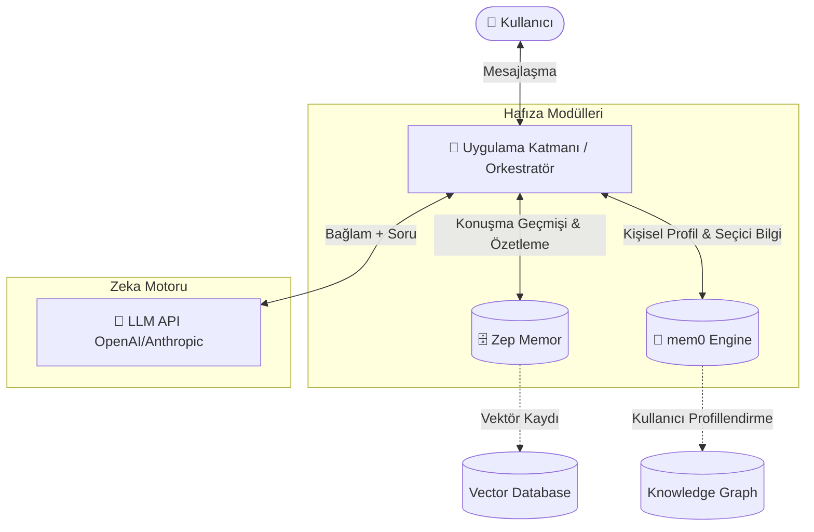
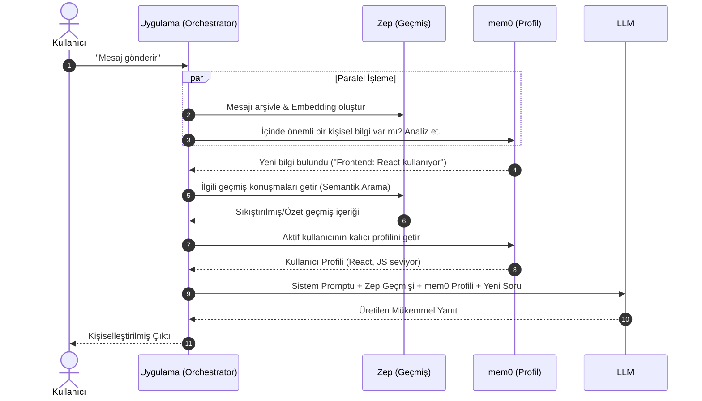

# 🧠 LLM Tabanlı Hafıza Mimarisi: Zep + mem0 Entegrasyonu

<!-- Badges -->


**Yapay Zeka Agent'ları için Uzun Süreli, Bağlamsal ve Akıllı Hafıza Yönetim Sistemi**

---

## 📖 İçindekiler
- [1. Problem Tanımı: Neden Hafızaya İhtiyacımız Var?](#1-problem-tanımı-neden-hafızaya-ihtiyacımız-var)
- [2. Proje Amacı ve Çözüm Yaklaşımı](#2-proje-amacı-ve-çözüm-yaklaşımı)
- [3. Sistem Mimarisi](#3-sistem-mimarisi)
- [4. Çekirdek Bileşenler](#4-çekirdek-bileşenler)
- [5. Çalışma İş Akışı (Workflow)](#5-çalışma-iş-akışı-workflow)
- [6. Gerçek Hayat Uygulama Senaryosu](#6-gerçek-hayat-uygulama-senaryosu)
- [7. Kurulum ve Hızlı Başlangıç](#7-kurulum-ve-hızlı-başlangıç)
- [8. Gelecek Vizyonu & Yol Haritası](#8-gelecek-vizyonu--yol-haritası)

---

## 1. Problem Tanımı: Neden Hafızaya İhtiyacımız Var?

Günümüzde standart Büyük Dil Modelleri (LLM) **Stateless (Durumsuz)** bir mimariyle çalışır. Her "chat" oturumu sıfırdan başlar. Sistem, oturum kapandığında kullanıcının tercihlerini, anlattıklarını ve geçmiş etkileşimlerini kalıcı olarak unutur.

> [!WARNING]  
> **Stateless Tasarımın Dezavantajları:**
> - Kullanıcının kendini sürekli tekrar etmesi (örn. "Ben Python geliştiricisiyim").
> - Bağlam kaybı nedeniyle verilen cevapların "genel geçer" ve kişiselleştirmeden uzak olması.
> - Bütün mesaj geçmişinin prompt içinde taşınmasının **Yüksek API/Token Maliyetine** ve gecikmelere (latency) yol açması.

---

## 2. Proje Amacı ve Çözüm Yaklaşımı

Bu proje, bir AI uygulamasının (Agent) tıpkı bir insan gibi geçmiş konuşmaları **hatırlamasını**, bu bilgilerden **öğrenmesini** ve gelecek etkileşimlerde bu bağlamı kullanarak **kişiselleştirilmiş yanıtlar** verebilmesini sağlar.

**Ana Hedeflerimiz:**
1. **Kalıcı Depolama:** Konuşmaları vektör bazlı bir yapıda güvenle saklamak.
2. **Akıllı Filtreleme:** Sadece "önemli" detayları ayıklayıp "gereksiz" sohbetleri süzmek.
3. **Maliyet Optimizasyonu:** Konuşma uzadıkça token sayısının artmasını engellemek için akıllı özetleme yapmak.

---

## 3. Sistem Mimarisi

Sistem birbirini tamamlayan 3 ana parçadan oluşmaktadır. Bu üçlü yapı, bir orkestratör aracılığıyla birleşerek tam donanımlı bir hafıza motoru oluşturur.



---

## 4. Çekirdek Bileşenler

### 🤖 LLM (Cevap Üreticisi)
Sistemin beynidir. Kendi başına hafızası yoktur ancak `Zep` ve `mem0`'dan gelen doğru bağlamla beslendiğinde son derece kişisel, doğru ve tutarlı çıktılar üretir.

### 🗄️ Zep (Konuşma ve Bağlam Hafızası)
AI uygulamaları için geliştirilmiş açık kaynaklı/bulut tabanlı hafıza altyapısıdır.
- **Kesintisiz Arşiv:** Gelen ve giden tüm mesajları saklar.
- **Otomatik Özetleme:** Mesaj sayısı belirli bir limiti aşınca, geçmiş konuşmaları token dostu bir formata "özetleyerek" sıkıştırır.
- **Semantik Arama (RAG):** Vektör embedding'leri üzerinden "Bu konuyla ilgili önceden ne konuşmuştuk?" sorusuna anlık cevap bulur.

### 🧠 mem0 (Akıllı ve Seçici Öğrenme Hafızası)
Zep her şeyi bir kara kutu gibi kaydederken, mem0 bir **editör/analist** gibi davranır.
- **Bilinçli Filtreleme:** "Bugün hava güzel" gibi geçici detayları atlar.
- **Profil İnşası:** "Kullanıcı glutensiz besleniyor", "Kullanıcının köpeğinin adı Karabaş" gibi kalıcı ve yapılandırılmış özellikleri ayıklayıp bir **Kullanıcı Profili** inşa eder.

> [!TIP]
> **Zep vs. mem0:** Zep sizin günlük anı defterinizdir (her şeyi yazar). Mem0 ise kimlik kartınızdır (sadece kalıcı, tanımlayıcı özellikleri tutar).

---

## 5. Çalışma İş Akışı (Workflow)

Kullanıcı "Yeni projemi React ile yazacağım" dediği an sistemde şu işlemler paralel olarak gerçekleşir:



---

## 6. Gerçek Hayat Uygulama Senaryosu

Mimarinin pratik faydasını anlamak için aşağıdaki "Önce/Sonra" senaryosuna bakınız:

| Gün | Kullanıcı Mesajı | ❌ Standart Sistem (Hafızasız) | ✅ Zep + mem0 Mimarisi (Hafızalı) |
| :--- | :--- | :--- | :--- |
| **Pazartesi** | "Ben Kotlin backend geliştiricisiyim." | *Cevap verir ve hemen unutur.* | mem0: `Alan: Backend, Dil: Kotlin` olarak kaydeder. Zep arşive alır. |
| **Cuma** | "Sence bir web uygulaması için hangi veritabanını kullanmalıyım?" | "PostgreSQL, MongoDB vb. kullanabilirsiniz." (Genel Cevap) | "Zaten bir **Kotlin Backend** geliştiricisi olduğunuz için Hibernate veya Exposed ORM'leri ile mükemmel çalışan **PostgreSQL** sizin için en iyi seçim olacaktır." (Kişiselleştirilmiş Cevap) |

---

## 7. Kurulum ve Hızlı Başlangıç

*(Bu bölüm kod tarafı geliştikçe detaylandırılacaktır)*

### Gereksinimler
- Python 3.10+
- OpenAI API Key veya eşdeğer bir LLM API anahtarı
- (Opsiyonel) Lokal Zep Sunucusu

### Adımlar
```bash
# Repo'yu klonlayın
git clone https://github.com/KULLANICI_ADI/zep_mem0_memory.git
cd zep_mem0_memory

# Gerekli kütüphaneleri yükleyin
pip install -r requirements.txt

# Çevre değişkenlerini ayarlayın
cp .env.example .env
# .env dosyasını gerekli API anahtarlarıyla (OPENAI_API_KEY, ZEP_API_URL vs.) düzenleyin.

# Projeyi başlatın
python main.py
```

---

## 8. Gelecek Vizyonu & Yol Haritası

- [ ] **Gelişmiş RAG Entegrasyonu**: Kendi veritabanı dosyalarımızı da (PDF, Doc) hafızaya eklemek.
- [ ] **Çoklu Kullanıcı Desteği (Multi-tenancy)**: Aynı anda yüzlerce farklı kullanıcının profilini izole etmek.
- [ ] **Human-in-the-loop Hafıza Onayı**: Sistem mem0'a bir bilgi eklerken kullanıcıdan onay istemesi ("Bu bilgiyi profiline ekleyebilir miyim?").
- [ ] **Açık Kaynak Yerel Modeller**: Ollama veya vLLM ile Llama 3 kullanarak veri gizliliğini %100 lokal hale getirmek.
