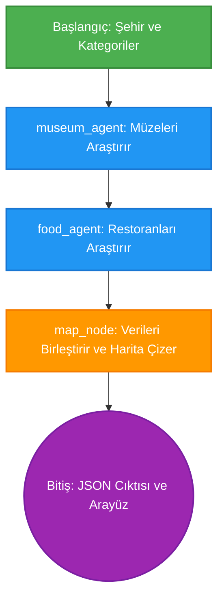

# 🌍 Otonom Şehir Kaşifi (Autonomous City Explorer)


Otonom Şehir Kaşifi, **LangGraph**, **Streamlit**, **Folium** ve **OpenStreetMap** kullanılarak geliştirilmiş, belirlediğiniz bir şehirdeki en iyi müzeleri ve restoranları bulan ve bu mekanları interaktif bir harita üzerinde gösteren yapay zeka ajan (AI Agent) tabanlı bir uygulamadır.

## 🚀 Proje Hakkında

Bu uygulama, birbirine bağlı ajanların otonom olarak veri toplayıp işlemesini ve sonuçları kullanıcının anlayabileceği bir haritaya ve listelere dönüştürmesini simüle eder. Yapay zeka ajanları belirli bir akışta çalışarak **(Graf Mimarisi)** birbirlerinin bulgularını zenginleştirir. Projede herhangi bir ücrete veya özel API anahtarına ihtiyaç yoktur, gücünü açık kaynak harita servisi Nominatim'den alır!

---

## 🏗️ Proje Mimarisi ve Ajan Akışı (LangGraph) 

Sistemin kalbinde LangGraph yatıyor. Ajanların hangi sırayla çalıştığını ve verinin sistem içinde nasıl aktığını aşağıdaki diyagramda inceleyebilirsiniz:



### Akışın Açıklaması:
1. **Şehir Verisi (Başlangıç):** Kullanıcı UI'dan şehri girer ve istek `graph.py` aracılığıyla sisteme aktarılır.
2. **Museum Agent:** Şehirdeki müzeleri `search_places` tool'u yardımıyla (OpenStreetMap) bulur.
3. **Food Agent:** Müzelerden hemen sonra restoranları arar. İstenirse paralel bile çalıştırılabilecek bir yapıda tasarlanmış state mimarisine sahiptir.
4. **Map Node:** `map_tool.py` kullanılarak toplanan tüm enlem/boylam noktaları alınır ve kullanıcı için interaktif bir .html haritası oluşturulur.
5. **Sonuç (Bitiş):** Sonuçlar tekrar Streamlit'e gönderilir ve sekmelerde harita/JSON görüntülenir. `ui.py` içindeki State mekanizması sayesinde sayfa yenilemelere karşı korunur.

---

## 📂 Dosya Yapısı

* **`ui.py`**: Streamlit tabanlı harici web arayüzü dosyasıdır. Ajanları çalıştırır, sonucu görselleştirir (Folium).
* **`main.py`**: Uygulamanın saf Python terminal/konsol versiyonudur. Sistemin hatasız kurulup kurulmadığını test edebilmenizi sağlar.
* **`graph.py`**: Ajanların (nodes) birbirine nasıl ve hangi şartlarda (`Edges`) bağlanacağını ayarlayıp (`StateGraph`) sistemi derler.
* **`state.py`**: Ajanların ortaklaşa kullandığı hafıza yapısını (Shared State -> `ExplorerState`) TypedDict aracılığıyla tanımlar.
* **`nodes.py`**: LangGraph düğümleri. Müzeleri arayan ajan, restoranları arayan ajan ve haritayı derleyen birleştirici düğüme sahiptir.
* **`tools.py`**: Dış dünyayla bağlantı noktasıdır. Ajanlar tarafından çağrılıp Nomination OpenStreetMap'ten REST API ile JSON çeker.
* **`map_tool.py`**: Elde edilen tüm koordinatlarıyla çeşitli renklerde nokta (marker) ekleyerek Folium'lu bir harita hazırlar.

---

## 🛠️ Kurulum ve Çalıştırma

Projenin çalışması için temel Python paketlerinin yüklü olması gerekir. Kurulum adımları:

1. **Gerekli Kütüphaneleri Yükleyin:**
Terminalinizde (Powershell/CMD terminali) aşağıdaki komutu çalıştırarak gerekli bağımlılıkları yükleyin:
```bash
pip install streamlit streamlit_folium folium langgraph requests
```

2. **Web Arayüzünü (.ui) Başlatın:**
```bash
streamlit run ui.py
```
*(Sayfa otomatik olarak tarayıcınızda açılmazsa, terminalde yazılan `Local URL: http://localhost:8501` linkine tıklayın.)*

3. **Alternatif - Terminalden Kontrol:**
Eğer arayüzsüz test etmek ve çıktıları dosyaya (JSON & HTML) almak isterseniz konsol altından şu programı çalıştırabilirsiniz:
```bash
python main.py
```

---

## ✨ Özellikler

- 📍 **Otonom Hedef Bulma**: Koordinatlara ihtiyaç duymadan sistem sadece şehrin ismini vererek restoranları bulur.
- 🎨 **Interaktif Harita**: Harita üzerinde zoom yapabilir, ikonlara tıklayıp mekanların ismini anlık okuyabilirsiniz. (Folium Kartografik Motoru).
- 🧩 **Sayfa Durum Yönetimi (Stateful Application)**: Oluşturulan sonuçlar, sayfanın tekrar yenilenmesi (`rerun`) durumunda ekrandan kaybolmaz (`st.session_state` mimarisi).
- 🔒 **Güvenli API**: Kayıt veya kredi kartı mecburiyeti olmayan OpenStreetMap kullanılır, kullanıcı limiti ve API KEY gerektirmez!

> **💡 Not:** Her ajan şimdilik bulunduğunuz bölgeden en iyi/varsayılan 5 mekanı (limit) getirecek şekilde programlanmıştır. Bunu değiştirmek için `tools.py`'ın içindeki API parametrelerine ufak bir düzenleme yapabilirsiniz.
